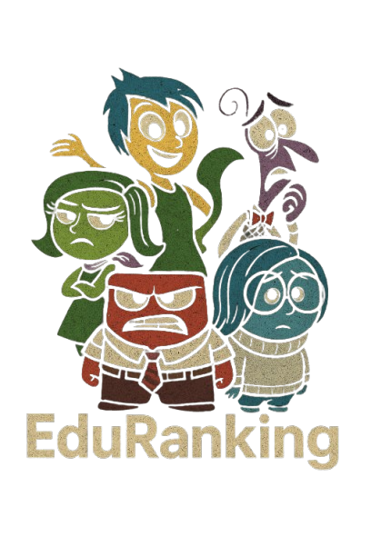

# EduRanking
O EduRanking é um sistema de avaliação de professores desenvolvido durante o Processo Trainee da **CJR** - Empresa Júnior de Computação da UnB do semestre 25.1.

<p align="center">
  
</p>

## Sobre o Projeto
O grupo escolheu desenvolver o sistema baseado no filme **Divertidamente** da Pixar/Disney. O site será tematizado no filme e as avaliações de professores serão guiadas por uma emoção: Alegria, Tristeza, Raiva, Nojo e Medo. As funcionalidades do sistema serão: 
- Cadastro e login de usuários
- Avaliação de professores e disciplinas
- Comentários em avaliações

## Equipe 

<table align="center">
  <tr>
    <td align="center">
      <br>
      <b><a href="https://github.com/arthurfernandesj">Arthur Fernandes</a></b><br>
    </td>
    <td align="center">
      <br>
      <b><a href="https://github.com/artmendess">Arthur Mendes</a></b><br>
    </td>
    <td align="center">
      <br>
      <b><a href="https://github.com/maymarquee">Mayara Marques</a></b><br>
    </td>
    <td align="center">
      <br>
      <b><a href="https://github.com/pedrobamaral">Pedro Amaral</a></b><br>
    </td>
  </tr>
</table>

## Tecnologias Utilizadas
As tecnologias utilizadas no projeto são: 

### Front End
- [Next.js](https://nextjs.org/)
- [React](https://reactjs.org/)
- [Tailwind CSS](https://tailwindcss.com/)

### Back End
- [NestJS](https://nestjs.com/)
- [Prisma ORM](https://www.prisma.io/)
- [SQLite](https://www.sqlite.org/)

Esse repositório conta com as partes **Front End** e **Back End** do projeto, que estão separadas em suas respectivas pastas. 

## Pré requisitos
Para rodar o projeto, é necessário que essas dependências estejam instaladas na sua máquina:
- [Node.js](https://nodejs.org/en)

## Como rodar o projeto?

**1. Clone o Repositório**  
Para clonar o repositório, você pode rodar esse comando pelo terminal:

```
git clone https://github.com/pedrobamaral/pt-cjr-grupo5.git
```
**2. Acesse a pasta do repositório**  
```
cd pt-cjr-grupo5
```

### Como rodar o Front End

**1. Acesse a pasta do Front End**
Caminhe até a pasta do FrontEnd com o comando:
```
cd FrontEnd
```
**2. Instale as dependências do Next.Js**
No terminal, digite os comandos: 
```
npm install
# ou
yarn install
```
**3. Execute em modo de desenvolvimento**
Rode o comando apropriado: 
```
npm run dev
# ou
yarn dev

No backEnd se existir:
npm run start:dev
```
**4. Acesse no navegador**

```
Para frontend Next.js: vá em http://localhost:3000
```

### Como rodar o Back End

**1. Acesse a pasta de Back End**  
Caminhe até a pasta do backend com o comando:
```
cd backend
```
**2. Instale o NestJS**  
No terminal, digite os comandos: 
```
npm install -g @nestjs/cli
npm install @nestjs/platform-express
```
**3. Instale o Prisma**
```
npm install prisma -g
```

**4. Inicialize o BackEnd**
```
npx prisma studio
```


